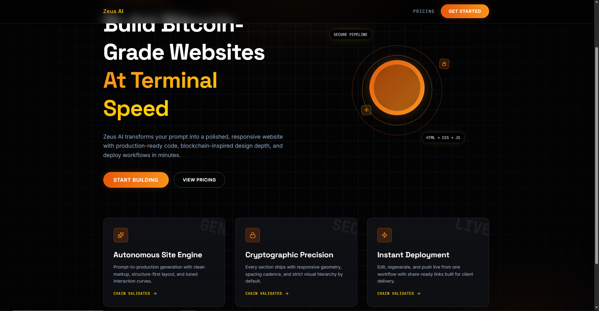
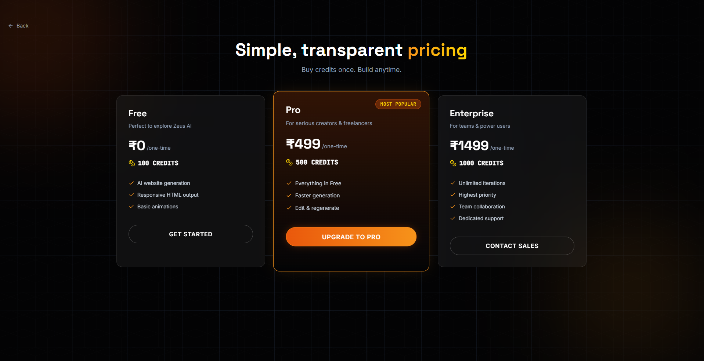
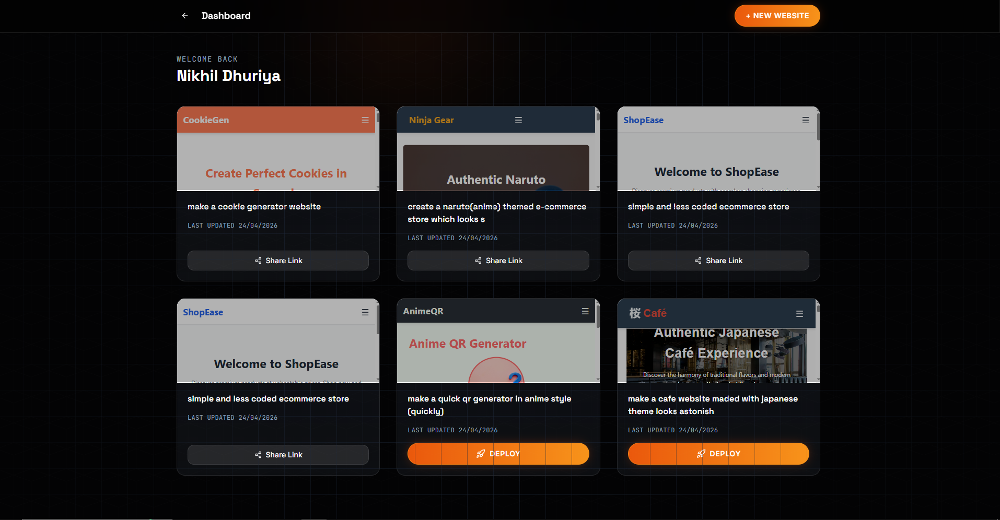
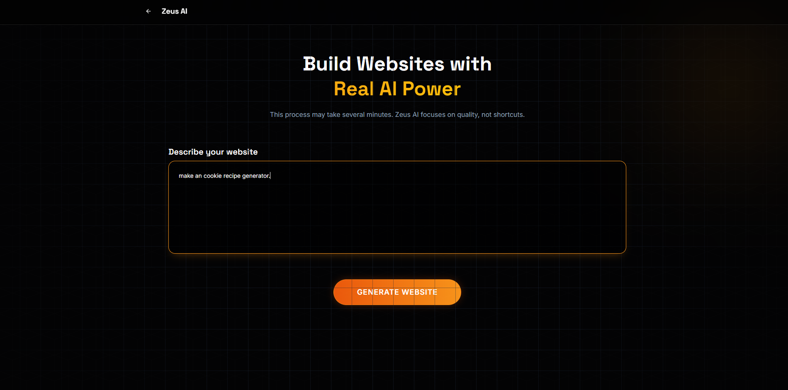
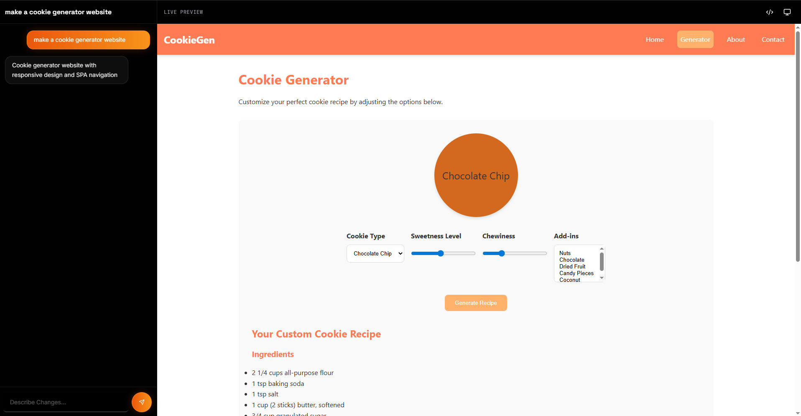
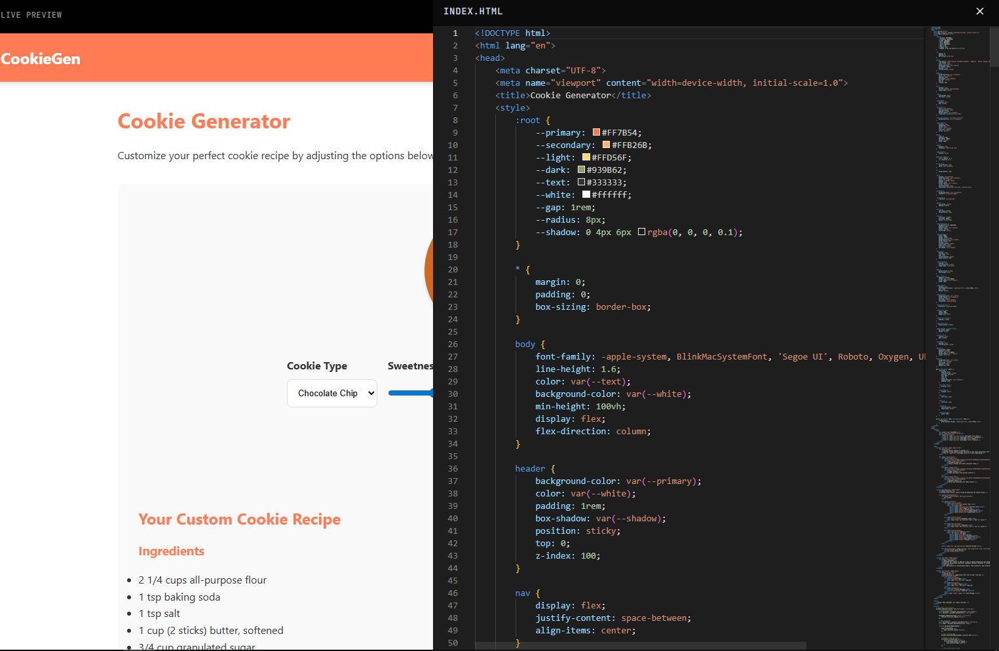
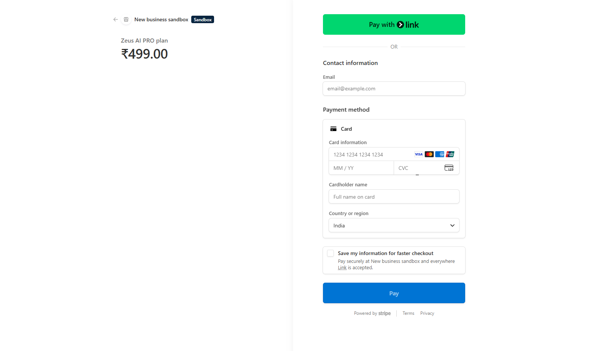

# Zeus AI Website Builder

Zeus AI is a full-stack AI website builder that turns natural language prompts into production-ready websites, then lets users edit, preview, and deploy them from one workflow.

The product combines a React + Tailwind frontend with a Node/Express backend, OpenRouter-powered generation, Stripe billing, and user account flows.

## What This Project Does

- Generates websites from prompt input
- Supports iterative updates/regeneration
- Provides live preview and code editing workflow
- Includes dashboard-based website management
- Supports one-click deployment and share links
- Uses credit-based pricing and Stripe checkout

## Key Flows

1. User signs in and gets credits.
2. User writes a website prompt.
3. Zeus AI generates code and opens editor/preview.
4. User updates code or requests changes.
5. User deploys and shares the live website.

## Screenshots

### Home / Landing



### Pricing



### Dashboard



### Live Preview Editor



### Code View / Source Panel



### Stripe Checkout



### Website Generation Flow



## Tech Stack

### Frontend

- React (Vite)
- Tailwind CSS
- Redux Toolkit
- Monaco Editor
- Framer Motion / Motion
- Axios + React Router

### Backend

- Node.js + Express
- MongoDB + Mongoose
- Firebase Authentication
- Stripe API + Webhooks
- JWT/Cookie auth middleware

## API Highlights

From [server/routes/website.routes.js](server/routes/website.routes.js):

- `POST /api/website/generate` - generate website
- `POST /api/website/update/:id` - apply changes
- `GET /api/website/get-by-id/:id` - fetch one project
- `GET /api/website/get-all` - fetch user projects
- `GET /api/website/deploy/:id` - deploy website
- `GET /api/website/get-by-slug/:slug` - public site by slug

## Local Setup

## 1) Install dependencies

```bash
cd client
npm install

cd ../server
npm install
```

## 2) Start backend

```bash
cd server
npm run dev
```

## 3) Start frontend

```bash
cd client
npm run dev
```

Frontend runs on Vite default port and backend uses Express with CORS configured for local client origin.

## Research Paper Notes (For Future Reference)

Source paper (online):

- **Title:** Zeus AI: A Natural Language-Driven Website Builder Platform with Multi-API Orchestration and Real-Time Code Synthesis
- **Journal:** International Journal of Advanced Research in Science, Communication and Technology (IJARSCT), Vol 6, Issue 12, April 2026
- **DOI:** 10.48175/IJARSCT-33756
- **PDF:** http://www.ijarsct.co.in/Paper33756.pdf

### Claimed Innovations in the Paper

- Prompt augmentation pipeline to improve generation quality
- Multi-provider orchestration with OpenRouter (primary) and Gemini (fallback)
- Real-time Monaco editor + live preview workflow
- Conversational modification assistance
- Stripe-powered credit monetization

### Reported Early Results (Paper)

- Multi-page website generation under 5 minutes (typical conditions)
- Failover reroute under 800ms in controlled tests
- UAT with 15 non-technical users: mean workflow time 7.4 minutes, SUS 81.3

### Future Directions Mentioned in the Paper

- AI-generated visual assets/images
- Built-in e-commerce features (catalog + checkout)
- Behavior-driven personalization
- Custom domain + automated SSL/TLS provisioning
- Multi-language website generation
- Domain-specific fine-tuned models for better niche quality

## Current Repo Mapping to Paper Ideas

- Prompt-driven generation flow implemented in [client/src/pages/Generate.jsx](client/src/pages/Generate.jsx)
- Pricing and Stripe checkout flow in [client/src/pages/Pricing.jsx](client/src/pages/Pricing.jsx)
- Website management/deploy flow in [client/src/pages/Dashboard.jsx](client/src/pages/Dashboard.jsx)
- Website route layer in [server/routes/website.routes.js](server/routes/website.routes.js)

## License

Add your preferred license here (MIT, Apache-2.0, proprietary, etc.).
